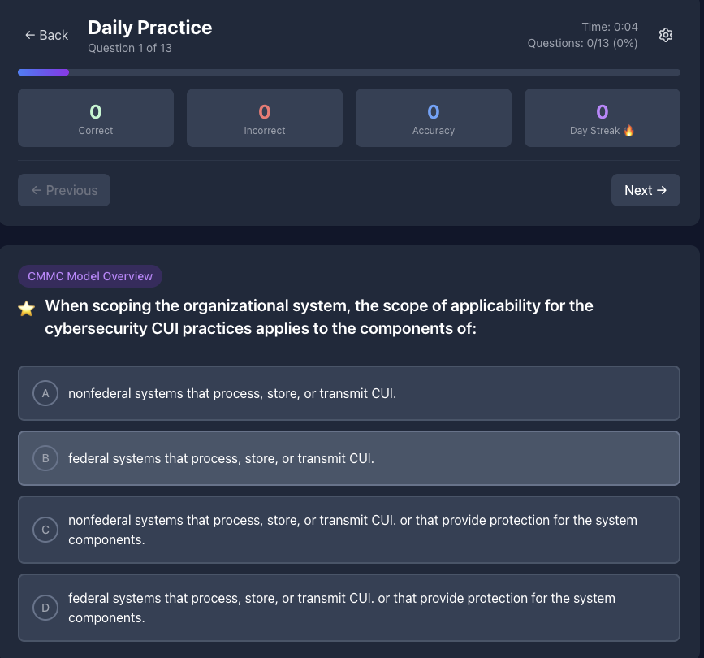

# GRC Professional Learning Platform

A comprehensive learning solution designed for **GRC engineers and compliance professionals** to master complex frameworks through intelligent study methods and adaptive learning technology.

## 🎯 Purpose & Learning Engine

This platform was created to solve the **GRC learning challenge** - transforming complex regulatory frameworks into manageable, retainable knowledge. 

**The Learning Engine:**
- **Spaced Repetition System** - Based on cognitive science principles to optimize long-term retention
- **Adaptive Question Selection** - Intelligently tracks performance and focuses on weak areas
- **Progressive Difficulty** - Builds confidence while challenging growth
- **Cognitive Load Management** - Breaks complex topics into manageable segments

## 🚀 Platform Features

### **Today's Mission - Daily Learning**
- **Daily Drills** - Consistent practice sessions to build momentum and maintain knowledge
- **Study Plan** - Personalized scheduling with exam countdown and progress tracking
- **Day Streak Tracking** - Motivational system to encourage consistent study habits
- **Mission-Based Learning** - Gamified approach with clear daily objectives

### **Domain-Specific Practice**
- **Focused Learning** - Target specific GRC domains (CMMC Assessment Process, Ecosystem, Implementation, Roles & Responsibilities)
- **Progress Tracking** - Visual progress indicators for each domain showing mastery percentage
- **Question Breakdown** - Clear visibility of question count per domain
- **Weakness Identification** - Automatic highlighting of areas needing improvement

### **Exam Simulation**
- **Full Practice Mode** - Complete exam simulation with all questions
- **Real Exam Environment** - Mimics actual test conditions for preparation
- **Performance Analytics** - Detailed breakdown of performance across all domains
- **Time Management** - Practice under realistic time constraints

### **Progress Metrics & Analytics**
- **Exam Readiness Score** - Overall readiness percentage based on performance
- **Domain Performance** - Detailed metrics showing strengths and improvement areas
- **Knowledge Retention Tracking** - Monitors long-term learning effectiveness
- **Visual Progress Indicators** - Charts and graphs for easy progress visualization

### **Memory & Review Systems**
- **Review Missed Questions** - Focused practice on incorrectly answered questions
- **Rapid Memory Mode** - Quick reinforcement for knowledge solidification
- **Adaptive Review** - Smart scheduling of review sessions based on forgetting curves
- **Mastery Reinforcement** - Strengthens foundational concepts through repetition

## 📸 Platform Screenshots

### Dashboard View

Main interface showing Today's Mission, daily drills, study plan, and domain-specific practice areas with progress tracking.

### Practice Mode  

Interactive question review with immediate feedback and detailed explanations for comprehensive learning.

### Exam Simulation

Full test environment with timer, navigation, and comprehensive review functionality for realistic exam preparation.

### Analytics Dashboard

Performance metrics, knowledge gap analysis, and progress tracking across all domains for data-driven improvement.

*Note: Screenshots demonstrate the platform interface with sample content. Actual question banks are private and customizable.*

## 🔧 Technology Stack

- **React 18** - Modern, responsive UI
- **Vite** - Lightning-fast development and builds
- **Tailwind CSS** - Professional, accessible design
- **localStorage** - Complete data privacy
- **Zero Dependencies** - No external API calls

## 📄 License

Educational and commercial use permitted.

---

**Built by GRC professionals, for GRC professionals.**  
*Transform how your organization approaches compliance training.*
