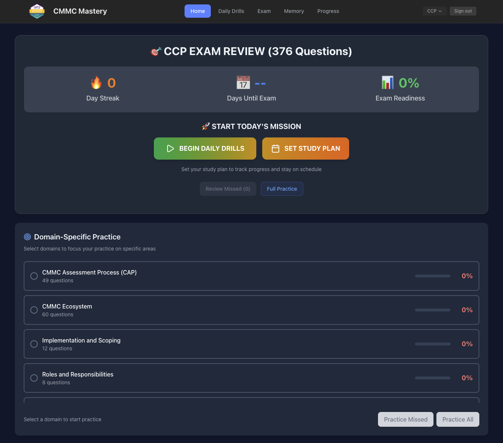
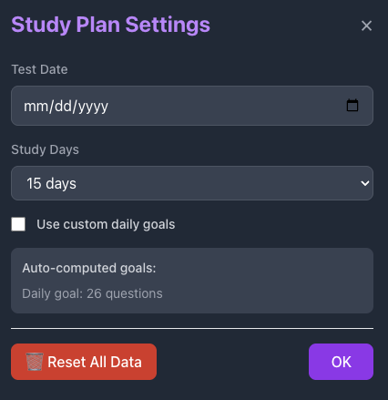
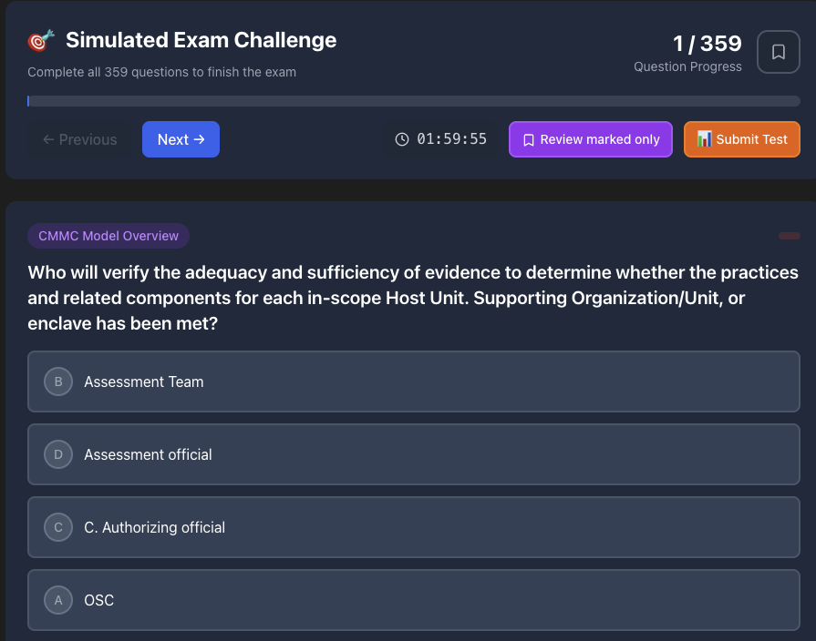

# GRC Test Simulator - Certification Exam Prep

A powerful test preparation platform designed to help **cybersecurity and GRC professionals** ace their certification exams through intelligent practice and knowledge reinforcement.

## 🎯 Certification Exam Readiness Platform

**Transform your study materials into interactive practice exams.** This simulator converts questions created by you or your instructors into smart test preparation tools that help you master critical security concepts and pass your certifications with confidence.

**Perfect for Certification Candidates:**
- **CMMC** (Cybersecurity Maturity Model Certification)
- **CGRC** (Certified Governance, Risk and Compliance) 
- **Security+** (CompTIA Security+)
- **ISO 27001** (Lead Implementer/Lead Auditor)
- **Any Security Certification** using your custom questions

## 🚀 Smart Test Preparation Features

### **PDF to Test Simulator Conversion**
- **Import Your Study Materials** - Transform your PDF questions into interactive practice tests
- **Smart Question Processing** - Automatically extract and organize your questions, answers, and explanations
- **Custom Exam Creation** - Build personalized practice tests from your own instructional content

### **Intelligent Study System**
- **Daily Mission Mode** - Structured daily practice to build momentum
- **Adaptive Question Selection** - Focus on weak areas and challenging concepts
- **Spaced Repetition** - Science-based learning for long-term retention
- **Progress Tracking** - Visual metrics showing exam readiness improvement

### **Exam Simulation Environment**
- **Real Test Conditions** - Practice under actual exam timing and pressure
- **Domain-Specific Practice** - Target weak areas by knowledge domain
- **Performance Analytics** - Detailed breakdown of strengths and improvement areas
- **Review Missed Questions** - Focused practice on incorrectly answered items

### **Knowledge Retention Tools**
- **Rapid Memory Mode** - Quick flashcard-style reinforcement
- **Study Plan Integration** - Personalized schedules with exam countdown
- **Streak Tracking** - Motivational system for consistent study habits
- **Mastery Indicators** - Visual progress for each knowledge domain

## 📸 Platform Screenshots

### Dashboard View

Main interface showing Today's Mission, daily drills, study plan, and domain-specific practice areas with progress tracking.

### Practice Mode  

Interactive question review with immediate feedback and detailed explanations for comprehensive learning.

### Exam Simulation

Full test environment with timer, navigation, and comprehensive review functionality for realistic exam preparation.

### Analytics Dashboard

Performance metrics, knowledge gap analysis, and progress tracking across all domains for data-driven improvement.

*Note: Screenshots demonstrate the platform interface with sample content. Actual questions created by you or your instructors are private and customizable.*

## 🔧 Technology Stack

- **React 18** - Modern, responsive UI
- **Vite** - Lightning-fast development and builds
- **Tailwind CSS** - Professional, accessible design
- **localStorage** - Complete data privacy
- **Zero Dependencies** - No external API calls

## 📄 License

Educational and commercial use permitted.

---

**Built by GRC professionals, for GRC professionals.**  
*Transform how your organization approaches compliance training.*
